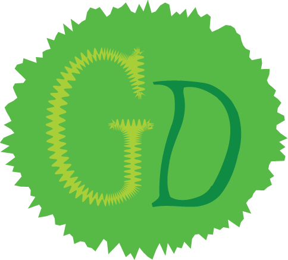

# Project Name: Good (shell)



## Description

- Written in the C Programming Language
- Uses a Buffer to store data
- Uses Various Simple File I/O methods
- Uses Simple Commands to do certain tasks

## Usage Table

| Command | Description |
| --- | --- |
| !q | Quits The Session Immediately |
| !speckles | Reads Any file |
| !fest | Creates Any File |
| !pen | Writes to Any File |
| !yell | Echoes Any Word |
| !fire | Delete&apos;s Any File |

```shell
#!/bin/bash

docker build -t good-shell .

# Note: Not using '-it' causes issues 
docker run -it good-shell
```
